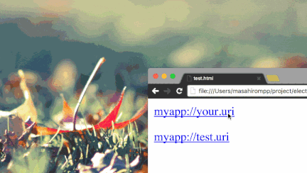

# electron-open-url-sample
electron open url sample.



# ToUse

```shell
# setup
git clone https://github.com/masahirompp/electron-open-url-sample.git
cd electron-open-url-sample
npm run setup

# build
npm run build # or watch

# run
npm run start -- myapp://your.uri

# package
npm run pack # output: MyApp.app, MyApp.exe

# create installer
npm run installer # output: MyApp.dmg, MyAppSetup.exe

# archive zip
npm run archive # output: MyApp-osx.zip, MyApp-win-ia32.zip, MyApp-win-x64.zip

```

# Test of custom URI scheme

<myapp://your.uri>

https://msdn.microsoft.com/en-us/library/aa767914(v=vs.85).aspx
